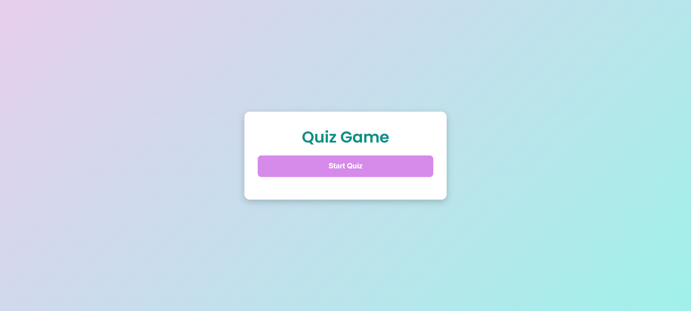
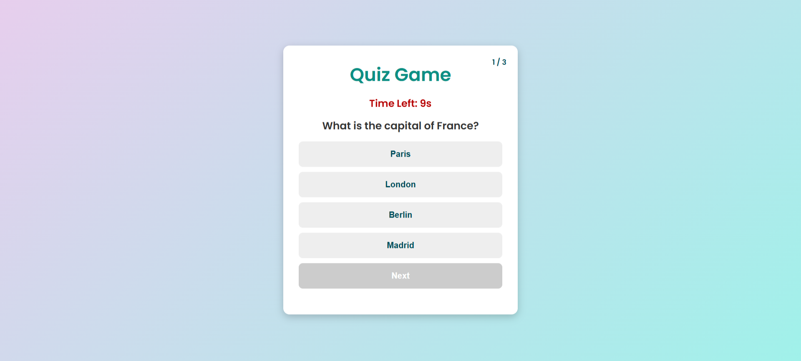
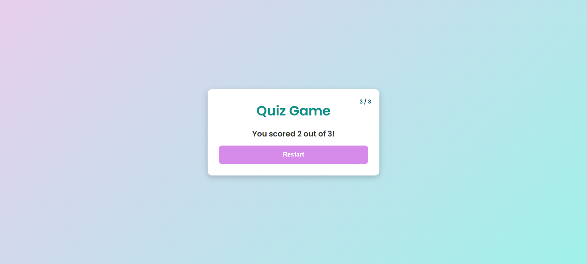

# Quiz Game

## Description

An interactive **Quiz Game** built using **HTML, CSS, and JavaScript**. The game presents multiple-choice questions with a **timer**, provides immediate feedback on selected answers, and keeps track of the score. Users can restart the quiz and try again!

## Features

- **Multiple-choice questions** with four answer options

- **Timer** for each question (10 seconds per question)

- **Score tracking** at the end of the quiz

- **Instant feedback** (Correct answers turn green, incorrect answers turn red)

- **Next Question button** to navigate through the quiz

- **Restart option** to replay the game

- **Smooth animations and transitions** for an engaging experience

## Technologies Used

- **HTML** – Structure of the game

- **CSS** – Styling, animations, and responsive layout

- **JavaScript** – Game logic and interactivity

## Installation

To run this project on your local machine:

1. Clone the repository:

git clone https://github.com/paridhis05/Quiz-Game.git

2. Navigate to the project folder:

cd Quiz-Game

3. Open the **index.html** file in a web browser.

## How to Play

1. Click **Start Quiz** to begin.

2. Read the question and select an answer.

3. The correct answer will be highlighted in **green**, incorrect in **red**.

4. Click **Next** to proceed to the next question.

5. At the end of the quiz, your **score** will be displayed.

6. Click **Restart** to play again.

## Screenshots

## Contributing

Want to enhance this project? Follow these steps:

- Fork the repository.

- Create a new branch (feature-branch)

- Commit your changes (git commit -m 'Added a new feature')

- Push the changes (git push origin feature-branch)

- Open a Pull Request